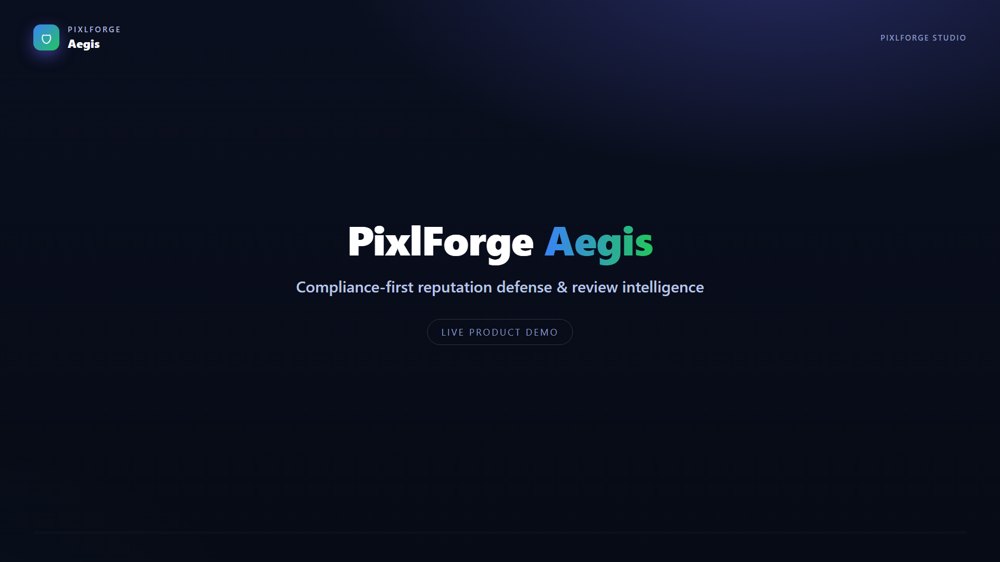
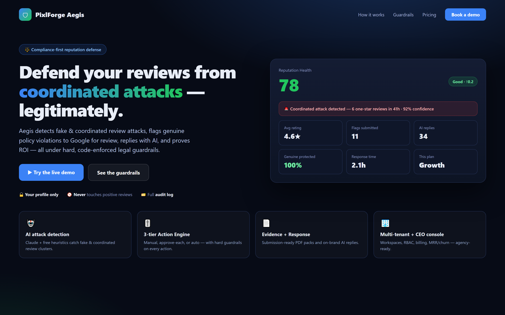
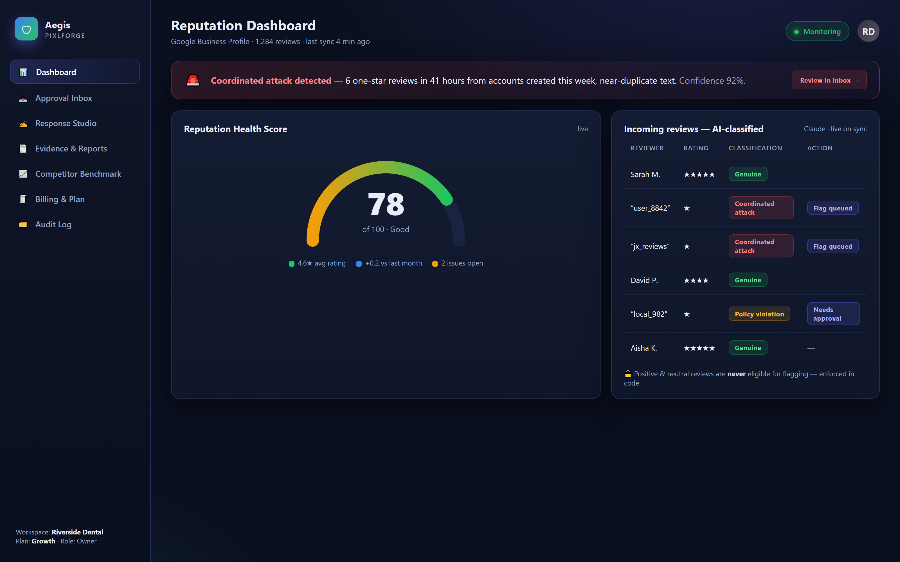
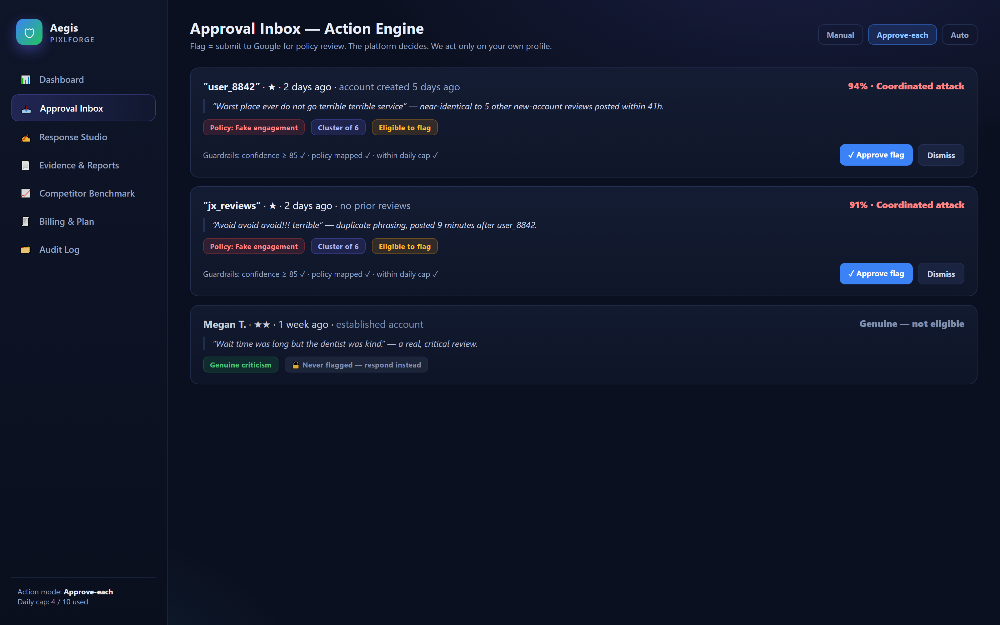
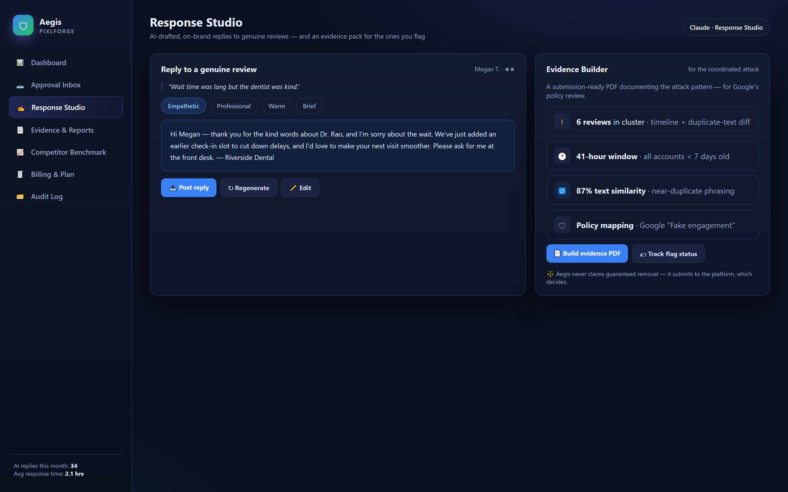
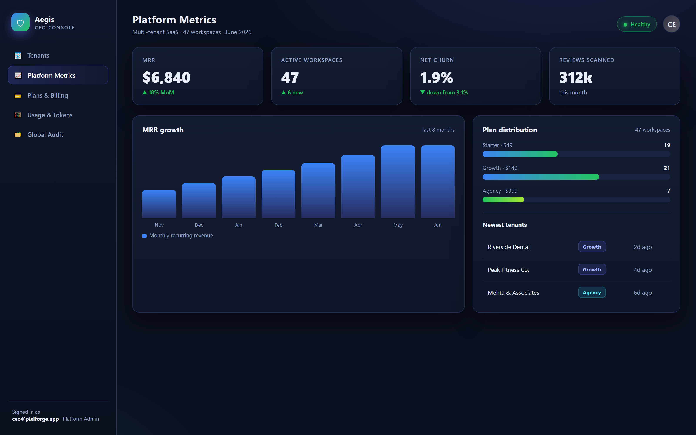

<div align="center">



# 🛡️ PixlForge Aegis

### Reputation Defense & Review Intelligence — *compliance-first*

*Detect coordinated review attacks. Flag, respond, and prove ROI — under hard, code-enforced legal guardrails.*

[](https://nextjs.org/)
[](https://fastapi.tiangolo.com/)
[](https://www.anthropic.com/)
[]()
[](#-license)

</div>

> **Compliance first.** Aegis never claims guaranteed review removal. "Flag" = *submit to the platform for policy review; the platform decides.* It only ever acts on a business's **own** Google Business Profile, and **never** touches positive or neutral reviews.

---

## 🎬 ~58-second demo

> **▶ [Watch the narrated walkthrough →](assets/aegis-teaser.mp4)** *(AI-narrated + subtitled)*

<div align="center">

[](assets/aegis-teaser.mp4)

</div>

<video src="https://github.com/Namanjain723/pixlforge-aegis/raw/main/assets/aegis-teaser.mp4" controls width="100%"></video>

---

## 💡 What it does

A business under a **coordinated review attack** — a burst of fake one-star reviews from brand-new accounts — has almost no legitimate way to respond fast. Aegis gives them one: it detects the attack with AI, assembles the evidence Google actually needs, flags the offending reviews *through the proper policy channel*, and replies to the genuine ones with on-brand AI — all while a code-enforced guardrail layer guarantees it never crosses an ethical or legal line.

---

## ✨ What's inside

| Module | Status |
|---|---|
| Multi-tenant workspaces + RBAC (Owner / Manager / Agency-Admin / Viewer) | ✅ Live |
| AI fake-review + **coordinated-attack detection** (Claude + free heuristics) | ✅ Live |
| **Reputation Health Score** (live gauge) | ✅ Live |
| **Action Engine** — Manual / Approve-each / Auto, with hard guardrails + audit log | ✅ Live |
| Approval Inbox + **auto-tier consent flow** | ✅ Live |
| **Evidence Builder** (PDF) + AI **Response Studio** + flag-status tracking | ✅ Live |
| Client dashboard · Marketer trends · **CEO console** (MRR / churn / plans) | ✅ Live |
| Billing plans + **plan gating** + GST-compliant invoices | ✅ Live (manual mode) |
| **Hindi / English** UI toggle · **PWA** · Monthly Reputation Report PDF · Reputation Badge widget | ✅ Live |
| **Google Business Profile** OAuth + ownership-verified import + review backfill | ✅ Built (add Google keys) |
| **Razorpay / Stripe** checkout + HMAC-verified webhooks → subscription lifecycle | ✅ Built (add keys) |
| **Email (Resend) + WhatsApp** alert fan-out | ✅ Built (add keys) |

> Every external integration is **fully coded** — it only needs the API key to go live. A 46-check all-keys integration test mocks only the network boundary and runs all real app logic end-to-end: **46/46 passing**.

---

## 📸 Inside the product

### 📊 Reputation Dashboard — health score + AI-classified reviews
A live Reputation Health Score, plus AI that labels every incoming review **genuine**, **policy violation**, or **coordinated attack** — with a code-level guarantee that positive/neutral reviews are never eligible for flagging.



### 📥 Approval Inbox — the 3-tier Action Engine
**Manual**, **Approve-each**, or **Auto** — and the guardrails are real: auto-tier requires confidence ≥ threshold **AND** a mapped policy category **AND** logged consent **AND** under the daily cap, or it falls back to approval. Genuine criticism is never flagged — you respond to it instead.



### ✍️ Response Studio + Evidence Builder
On-brand AI replies for genuine reviews, and a submission-ready **Evidence PDF** (timeline, duplicate-text diff, policy mapping) for the attacks you flag.



### 📈 CEO Console — run it as a SaaS
Multi-tenant MRR, churn, plan distribution and tenant management — agency-ready.



### 🚀 Public sales demo
A compliance-first landing + live demo to sell the product.


---

## 🔒 Guardrails (enforced in code, not comments)

- Positive / neutral reviews are **never** eligible for flagging.
- **Auto-tier** requires: confidence ≥ threshold (default 85) **AND** a mapped policy category **AND** explicit logged consent **AND** under the daily cap — else it falls back to approval.
- Every consequential action → an immutable **audit log**.
- No mass-flagging, no fake DMCA, no scraping that submits actions. Monitoring-only for non-API platforms.

---

## 🏗️ Architecture (hybrid, low-cost to host)

```
apps/
  api/   FastAPI (Python) · SQLAlchemy · APScheduler · ReportLab · Anthropic (Claude)
  web/   Next.js (App Router, TypeScript) · Tailwind · Recharts · PWA · i18n
```

- **DB:** SQLite locally (zero setup) → Postgres in prod via `DATABASE_URL`.
- **No Redis / Celery** — in-process APScheduler keeps hosting to a single small instance + cheap Postgres.
- **Secrets:** everything blank falls back to safe demo/mock behaviour, so the app always runs. Real keys live only in a local `.env` (never committed).

---

## 🧭 Roadmap to "live"

1. **Now:** sell with the demo + run AI live with an Anthropic key.
2. **~1 month:** Google Cloud + GBP API approved → flip on real OAuth + review sync (slot ready).
3. **When ready:** add Razorpay / Stripe keys to automate billing (manual GST invoicing works today).

---

## 👤 Author

**Naman Jain** — PixlForge Studio
📧 [info@pixlforgestudio.in](mailto:info@pixlforgestudio.in)
🔗 [github.com/Namanjain723](https://github.com/Namanjain723)

## 📄 License

© PixlForge Studio. All rights reserved. This public repository is a **showcase** — documentation, screenshots and the demo video only. The full source is private and the product is proprietary.

---

<div align="center"><sub>PixlForge Aegis — reputation defense, done right.</sub></div>
